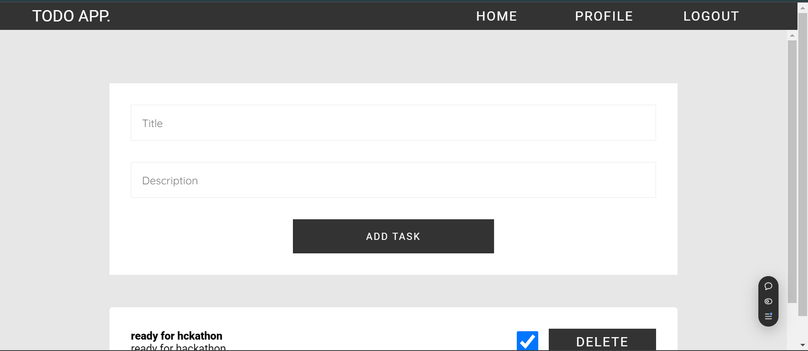
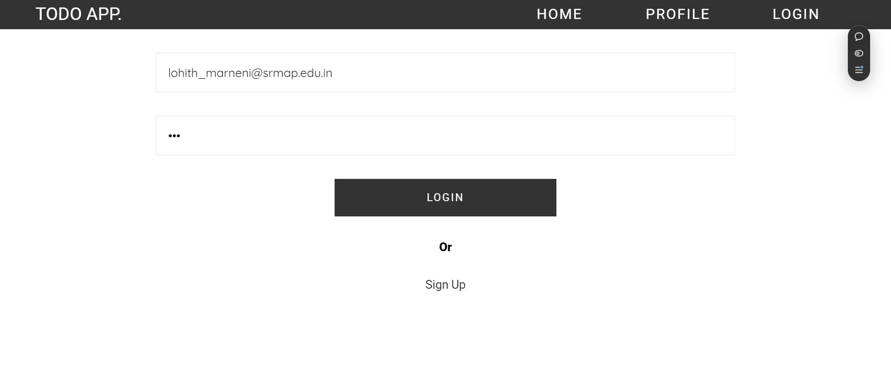

# ToDo-MERN
<p align="center">
  
</p>
This ToDo list application is built using the MERN stack (MongoDB, Express, React, Node.js) to provide users with an intuitive interface to manage their tasks. Users can create, update, delete, and mark tasks as completed, helping them stay organized. The backend is powered by Express.js and Node.js, offering a REST API for managing task data, which is stored in MongoDB. The frontend, built with React, provides a responsive design, making it accessible on both desktop and mobile devices. The application is scalable and can easily integrate additional features such as user authentication, task categorization, and priority settings.

Furthermore, this project demonstrates the power of full-stack development with modern tools, enhancing skills in API development, database management, and React-based UI creation.

## Features
- Create, edit, and delete tasks
- Mark tasks as completed
- Responsive design
- Backend REST API with Express and Node.js
- MongoDB for data storage
- Frontend built with React
<p align="center">
  
</p>
## Installation
1. Clone the repository:
   ```bash
   git clone https://github.com/LohithMarneni/ToDo-MERN
   
2. Navigate to the backend and frontend folders, and install dependencies:
    ```bash
    cd Backend
    npm install
    cd ../Frontend
    npm install 
3. Start the backend server:
    ```bash
    cd Backend
    npm start
    
## Tech Stack
- Frontend: React
- Backend: Node.js, Express.js
- Database: MongoDB
- Deployment: Vercel
